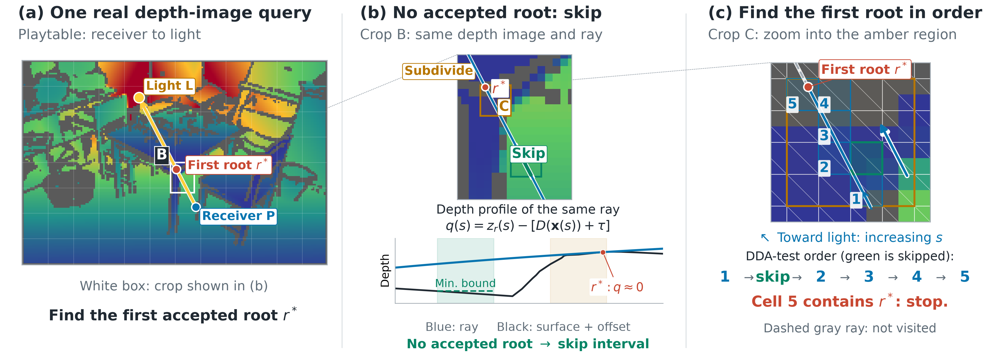
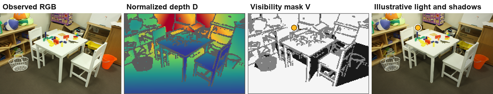
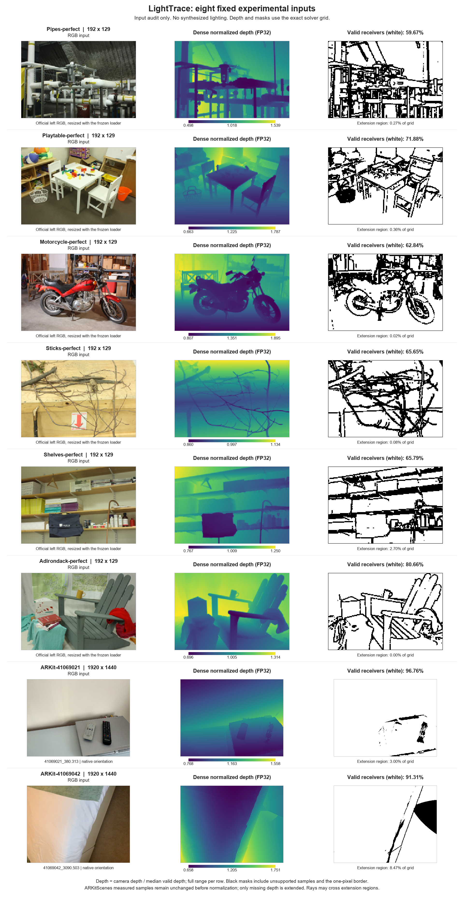

# LightTrace: Efficient Ray-Surface First-Hit Queries on Fixed Depth Images

## Supplementary material

LightTrace skips ray intervals that cannot contain an intersection accepted by a shared DDA reference. This supplement supports three claims: **preserved first-hit accuracy, fewer logical traversal reads, and lower GPU query latency**. We evaluate virtual-light visibility queries on eight fixed depth images using two complete experimental runs.

[Method](#method) · [Inputs](#inputs) · [Results](#results) · [Ablation](#ablation) · [Detailed measurements](details.md) · [Downloads](#downloads)

## Method

LightTrace combines ray depths with conservative surface-depth bounds from a minimum-depth pyramid to bound the depth residual along each interval. It skips an interval only when the bound rules out every DDA-accepted intersection. It refines unresolved regions and applies the shared DDA intersection test at the finest level, in ray order.

Green intervals are skipped; amber regions need finer tests. The right panel proceeds from bottom-right to top-left: test 1, skip the green cell, then test cells 2-5 and stop at the first root. Numbers indicate test order. Bounds and traversal are CPU reconstructions of a saved DDA/LightTrace query.

Application example: visibility-guided lighting

White, black, and gray in the mask mean visible, occluded, and excluded receivers. The last panel applies a display-only light term to the captured RGB. Illumination is interpolated across excluded pixels without changing the measured mask. The illustration preserves RGB detail and captured lighting; it is not complete relighting.

## Inputs

Six **Middlebury 2014** inputs cover thin structures, layered clutter, and broad smooth regions. Two **ARKitScenes** frames from distinct visits add native-resolution RGB and FARO mesh-projected reference depth.

| Dataset | Input | Query grid | Valid receivers | Scene content |
|---|---|---:|---:|---|
| Middlebury | Pipes | 192 × 129 | 14,779 | Pipes and thin structures |
| Middlebury | Playtable | 192 × 129 | 17,802 | Layered tabletop objects |
| Middlebury | Motorcycle | 192 × 129 | 15,563 | Fine structures and depth changes |
| Middlebury | Sticks | 192 × 129 | 16,259 | Thin rods |
| Middlebury | Shelves | 192 × 129 | 16,295 | Layered clutter |
| Middlebury | Adirondack | 192 × 129 | 19,977 | Broad smooth regions |
| ARKitScenes | 41069021 | 1920 × 1440 | 2,675,166 | Cabinet and controls |
| ARKitScenes | 41069042 | 1920 × 1440 | 2,524,583 | Bed edge and floor |

View all eight inputs, prepared depths, and receiver masks

White mask pixels are queried; black pixels are excluded. Depth colors have a separate full-range scale per input. ARKitScenes retains its native registered orientation. [Selection and preprocessing details](details.md#input-selection-and-preparation) specify the common depth extension and receiver exclusions.

## Results

The experiments use Vulkan compute shaders on an **Intel(R) Graphics integrated GPU (device ID 0x7D45)**. DDA and Hi-Z are our exhaustive perspective-correct DDA and conservative RGBA Hi-Z implementations. All three methods share the same prepared depth, FP32 precision, triangulation, receiver masks, ray endpoints, and numerical intersection rule.

We test three smooth light trajectories with 240 positions each for Middlebury and 24 for ARKitScenes, using 12 and 6 counterbalanced paired repeats, respectively. Results give the two complete runs equal weight. Percentiles average the two run-level percentiles; paired savings average the two runs' geometric-mean per-repeat ratios. [Full protocol and uncertainty estimates](details.md#measurement-protocol) are retained.

### GPU latency and logical reads

Timings are warm **query-dispatch latency**, not complete application frame time. A separate instrumented build counts **logical traversal-record bytes**, not physical DRAM traffic.

DDA and LightTrace milliseconds below come from their pair; Hi-Z milliseconds come from the separate Hi-Z/LightTrace pair. Each saving uses its corresponding paired measurements.

| Input | DDA p95 | Hi-Z p95 | LightTrace p95 | Logical bytes saved vs. DDA | Paired p95 saved vs. DDA | Paired p95 saved vs. Hi-Z |
|---|---:|---:|---:|---:|---:|---:|
| Pipes | 1.643 | 1.067 | 0.345 | 74.9% | 79.0% | 67.9% |
| Playtable | 1.917 | 1.012 | 0.320 | 83.1% | 83.4% | 68.1% |
| Motorcycle | 1.879 | 0.968 | 0.329 | 83.4% | 82.7% | 65.7% |
| Sticks | 1.918 | 0.978 | 0.330 | 83.1% | 83.0% | 65.2% |
| Shelves | 1.798 | 0.893 | 0.300 | 83.8% | 83.3% | 66.7% |
| Adirondack | 1.959 | 1.280 | 0.388 | 82.3% | 80.2% | 69.7% |
| ARKit-41069021 | 1640.987 | 50.248 | 22.320 | 97.9% | 98.6% | 54.3% |
| ARKit-41069042 | 1587.861 | 98.113 | 32.489 | 97.4% | 98.0% | 66.2% |

LightTrace improves paired p95 latency on all eight inputs against both baselines. Each run's 95% confidence interval supports every paired p95 gain. The larger ARKitScenes gains are consistent with long rays across smooth regions. These are eight selected inputs on one GPU; differences in both geometry and resolution contribute to the observed gains.

### First-hit accuracy

| Dataset | Unique valid pixel-frame queries per method | Balanced visibility error | Shadow F1 | Maximum first-root error vs. DDA | Full-DDA fallback rate |
|---|---:|---:|---:|---:|---:|
| Middlebury, 6 inputs | 72,486,000 | 0 | 1 | 0 | 0 |
| ARKitScenes, 2 inputs | 374,381,928 | 0 | 1 | 0 | 0 |

Across **446,867,928 unique queries per method**, visibility and first-root outputs match DDA **bitwise**. The second run replays the same queries rather than adding new unique queries. No full-query DDA restart was needed; normal finest-level DDA tests remain part of LightTrace.

These measurements establish agreement on the tested queries. The mathematical correctness argument assumes conservative numerical bounds and error margins; a universal FP32 guarantee has not been established.

## Ablation

Changing only the traversal policy from coarsest-level restart to **local ascent** reduces paired p95 latency by **59.6%** and logical traversal bytes by **42.7%** across the six Middlebury inputs. Both variants use the same R32 hierarchy, bounds, and leaf tests; they match DDA and read identical numbers of triangle records.

This isolates the reduction in hierarchy work from changes to the intersection test. [Per-input ablation results](details.md#traversal-ablation) are available. A coarsest-level hierarchy restart is not full-DDA fallback.

## Detailed measurements

Per-frame curves, tail timings, read counts, and setup costs

- [All eight scenes' curves for both runs](details.md#trajectory-curves): per-frame medians and observed repeat ranges, with both paired comparisons kept separate.
- [Warm p50/p95/p99 tables](details.md#warm-query-latency), including each pair's own LightTrace timings.
- [Triangle-record reads and logical bytes](details.md#traversal-reads).
- [First-dispatch latency and one-time hierarchy setup](details.md#first-dispatch-and-hierarchy-setup), reported separately from warm latency.
- [Independent numerical checks and replication](details.md#validation).
- [Complete measurement protocol](details.md#measurement-protocol) and [input preparation](details.md#input-selection-and-preparation).

## Downloads

| Evidence | Files |
|---|---|
| Exact results, counts, paired confidence intervals, ablation, and setup costs | [Combined results](data/results.json) |
| Raw GPU timestamps for all repeats, including first dispatches and ablation | [Run 1 ZIP](data/run-1/raw-timings.zip) · [Run 2 ZIP](data/run-2/raw-timings.zip) |
| Per-run summaries, curve data, source hashes, and validation records | [Evidence index](details.md#evidence-files) |

All linked figures and records are included in this folder. The source RGB/depth datasets are obtained from their providers. No experimental results have been removed from the detailed records.

## Sources and credits

**Middlebury 2014:** Scharstein et al., *High-Resolution Stereo Datasets with Subpixel-Accurate Ground Truth*, GCPR 2014. [Official dataset](https://vision.middlebury.edu/stereo/data/scenes2014/).

**ARKitScenes:** Baruch et al., *ARKitScenes: A Diverse Real-World Dataset for 3D Indoor Scene Understanding Using Mobile RGB-D Data*, NeurIPS Datasets and Benchmarks 2021. [Official repository](https://github.com/apple-aiml-research/ARKitScenes) · [Reference-depth documentation](https://github.com/apple-aiml-research/ARKitScenes/blob/main/depth_upsampling/README.md) · [Retained license notice](data/ARKitScenes-LICENSE.txt).

Dataset images and derived previews are credited to their original providers and remain subject to the providers' terms.
