# Detailed measurements and reproducibility

[Back to the supplement](./)

This page retains the measurements and protocol behind the front page, including both complete runs, all eight inputs, first-dispatch costs, and latency tails.

## Measurement protocol

| Setting | Configuration |
|---|---|
| GPU | Intel(R) Graphics integrated GPU; device ID `0x7D45` |
| Implementation | Vulkan compute shaders; frozen v1.19c main solver binaries |
| Methods | Exhaustive perspective-correct DDA, conservative RGBA Hi-Z, and LightTrace |
| Shared intersection rule | Triangulated depth, FP32, thickness-and-bias offset 0.001 in median-depth units, ray-start cutoff 0.0001, and identical acceptance tolerances |
| Light motion | Horizontal sinusoid, accelerating sweep, and Lissajous trajectory |
| Middlebury sampling | 240 light positions per trajectory; 12 counterbalanced paired repeats; 512 stabilization frames per method block |
| ARKitScenes sampling | 24 light positions per trajectory; 6 counterbalanced paired repeats; 8 stabilization frames per method block |
| Timing | Uninstrumented Vulkan timestamps around the query dispatch; GPU stages run serially |
| Counting | Separate instrumented build; no counting overhead included in formal timing |
| Repetition | Two complete experimental runs with the same inputs, settings, and binaries |

DDA and Hi-Z are our matched implementations, both using the same triangulated-depth intersection test as LightTrace. LightTrace stores one R32 minimum-depth value per hierarchy node and shared global bounds. It uses local ascent during stackless traversal, with no per-ray temporal state or fallback queue.

**Aggregation.** Tables report equal-weight averages of the two runs. Each p50/p95/p99 entry averages the two run-level percentiles, rather than pooling frames. Each paired p95 saving is computed from the average of the two runs' geometric-mean per-repeat LightTrace/baseline ratios. DDA/LightTrace and Hi-Z/LightTrace are separate paired comparisons; their timings must not be mixed to calculate ratios. Confidence intervals remain separate for each run.

Timing measures **query-dispatch latency**, not complete application frame time. A few slow visibility updates can impair responsiveness even when typical updates are fast; p95 and p99 expose these slower updates. Input preparation, hierarchy construction, upload, CPU submission/readback, and application startup are outside the timed query dispatch.

## Input selection and preparation

The Middlebury inputs use the official `im0.png`, `disp0.pfm`, and `calib.txt` files. Disparity is resized to the common 192 × 129 grid with valid-support weighting; disparity and calibration are scaled together before conversion to depth. Unsupported values are extended by deterministic four-connected neighbor averaging. Receivers require support of at least 0.999, and the outer one-pixel border is excluded.

For ARKitScenes, the selected Validation frames are **41069021_380.313** from visit **381658** and **41069042_3090.503** from visit **381649**. The selection takes the upper temporal median of matching RGB/reference-depth frames in the first two eligible numerically ordered videos with distinct visit IDs. These are two close-up views from distinct visits, not room-wide panoramas.

ARKitScenes uses registered high-resolution RGB and **FARO mesh-projected reference depth**, not low-resolution LiDAR depth or a learned depth estimate. Positive native depth samples are not resampled or smoothed. Zero-depth locations are extended with four-connected neighbor means, then the field is normalized by median depth. Original invalid locations and the image border are excluded as receivers. Rays may cross the common extended field.

All methods use the same prepared field. Agreement with DDA therefore concerns this representation, including its shared depth extension; it does not recover unobserved geometry. Exact source files, preprocessing settings, masks, and array hashes are recorded in the [input manifest](data/run-1/inputs.json).

## Warm query latency

### DDA and LightTrace

All entries are milliseconds from the DDA/LightTrace pair.

| Input | DDA p50 | DDA p95 | DDA p99 | LightTrace p50 | LightTrace p95 | LightTrace p99 |
|---|---:|---:|---:|---:|---:|---:|
| Pipes | 1.378 | 1.643 | 1.793 | 0.311 | 0.345 | 0.384 |
| Playtable | 1.449 | 1.917 | 1.997 | 0.275 | 0.320 | 0.340 |
| Motorcycle | 1.460 | 1.879 | 2.062 | 0.286 | 0.329 | 0.346 |
| Sticks | 1.474 | 1.918 | 2.089 | 0.259 | 0.330 | 0.342 |
| Shelves | 1.414 | 1.798 | 1.853 | 0.262 | 0.300 | 0.312 |
| Adirondack | 1.515 | 1.959 | 2.014 | 0.298 | 0.388 | 0.413 |
| ARKit-41069021 | 1262.821 | 1640.987 | 1694.170 | 20.161 | 22.320 | 23.014 |
| ARKit-41069042 | 1085.186 | 1587.861 | 1672.066 | 23.836 | 32.489 | 35.323 |

### Hi-Z and LightTrace

All entries are milliseconds from the independent Hi-Z/LightTrace pair. Its LightTrace timings are retained separately rather than substituted with values from the DDA pair.

| Input | Hi-Z p50 | Hi-Z p95 | Hi-Z p99 | LightTrace p50 | LightTrace p95 | LightTrace p99 |
|---|---:|---:|---:|---:|---:|---:|
| Pipes | 0.872 | 1.067 | 1.136 | 0.310 | 0.350 | 0.381 |
| Playtable | 0.780 | 1.012 | 1.090 | 0.277 | 0.324 | 0.347 |
| Motorcycle | 0.806 | 0.968 | 1.013 | 0.288 | 0.334 | 0.359 |
| Sticks | 0.691 | 0.978 | 1.048 | 0.260 | 0.332 | 0.356 |
| Shelves | 0.709 | 0.893 | 0.939 | 0.259 | 0.298 | 0.310 |
| Adirondack | 0.816 | 1.280 | 1.382 | 0.297 | 0.388 | 0.411 |
| ARKit-41069021 | 40.829 | 50.248 | 53.230 | 20.057 | 22.367 | 28.546 |
| ARKit-41069042 | 71.082 | 98.113 | 110.830 | 23.711 | 33.305 | 38.020 |

Each method has 8,604 warm samples per Middlebury input and pair in each run, and 414 per ARKitScenes input and pair. All repeats, including latency spikes, are retained. Exact values, per-repeat ratios, and separate run-level confidence intervals are in [results.json](data/results.json).

## Traversal reads

Values are **mean / p95 per query**, aggregated over all valid pixel-frames. A triangle-record read is not the same unit as a hierarchy lookup. The byte total includes the triangle, hierarchy-node, level-table, and global-bound records, where applicable.

| Input | DDA triangle records | LightTrace triangle records | DDA logical bytes | LightTrace logical bytes |
|---|---:|---:|---:|---:|
| Pipes | 100.04 / 251 | 2.55 / 6 | 1600.68 / 4016 | 402.00 / 664 |
| Playtable | 146.16 / 329 | 1.94 / 5 | 2338.59 / 5264 | 394.45 / 660 |
| Motorcycle | 146.86 / 333 | 2.01 / 5 | 2349.71 / 5328 | 391.17 / 660 |
| Sticks | 146.47 / 325 | 2.62 / 6 | 2343.47 / 5200 | 396.74 / 628 |
| Shelves | 145.34 / 301 | 2.08 / 5 | 2325.44 / 4816 | 377.85 / 616 |
| Adirondack | 138.27 / 295 | 2.28 / 5 | 2212.34 / 4720 | 392.49 / 624 |
| ARKit-41069021 | 1672.17 / 3361 | 3.84 / 9 | 26754.70 / 53776 | 558.74 / 860 |
| ARKit-41069042 | 1553.26 / 3231 | 3.74 / 11 | 24852.16 / 51696 | 637.56 / 1296 |

These are **logical traversal-record bytes**, not measured DRAM traffic or all kernel memory traffic. Hi-Z's level-table loads were not instrumented, so a complete comparable Hi-Z byte total is unavailable. Its recorded payload is a lower bound, not zero. The full counting records and load categories are retained in [results.json](data/results.json).

## Traversal ablation

This comparison changes only the hierarchy level selected after forward progress: **local ascent** versus **restart at the coarsest level**. Both variants use the same R32 nodes, bounds, and leaf tests. Restarting at the coarsest hierarchy level here is not full-DDA fallback.

| Middlebury input | Coarsest restart p95 (ms) | Local ascent p95 (ms) | Paired p95 saved |
|---|---:|---:|---:|
| Pipes | 0.825 | 0.341 | 58.9% |
| Playtable | 0.767 | 0.315 | 58.9% |
| Motorcycle | 0.809 | 0.325 | 60.0% |
| Sticks | 0.816 | 0.328 | 60.0% |
| Shelves | 0.775 | 0.297 | 61.8% |
| Adirondack | 0.912 | 0.386 | 57.7% |

Across the six inputs, local ascent reduces paired p95 latency by **59.6%** and logical traversal bytes by **42.7%**. Both variants match DDA and read identical numbers of triangle records. The reduction therefore comes from hierarchy traversal, not from changing the accepted intersections. Aggregate ratios give scenes equal weight within each run and then average the two runs' ratios.

## First-dispatch and hierarchy setup

The following values are the p95 latency of **frame 0 of each trajectory**, after method-block stabilization. They are separate from warm samples and do not measure a cold device launch or pipeline compilation. Each run has 36 such samples per Middlebury method/pair and 18 per ARKitScenes method/pair.

| Input | DDA pair: DDA / LightTrace (ms) | Hi-Z pair: Hi-Z / LightTrace (ms) |
|---|---:|---:|
| Pipes | 1.447 / 0.359 | 0.871 / 0.348 |
| Playtable | 1.668 / 0.335 | 1.015 / 0.329 |
| Motorcycle | 1.604 / 0.314 | 0.904 / 0.323 |
| Sticks | 1.554 / 0.348 | 1.021 / 0.349 |
| Shelves | 1.489 / 0.305 | 0.817 / 0.297 |
| Adirondack | 1.586 / 0.331 | 1.066 / 0.328 |
| ARKit-41069021 | 1313.161 / 23.317 | 53.874 / 24.165 |
| ARKit-41069042 | 1200.820 / 28.086 | 80.472 / 27.256 |

Hierarchy construction and mapped-buffer upload are **one-time CPU observations from the counting passes**, averaged over the two runs. They exclude depth preparation, device creation, and pipeline creation. The current LightTrace builder constructs shared RGBA bounds and then extracts R32 nodes and global bounds; that work is included below.

| Input | LightTrace build / upload (ms) | Hi-Z build / upload (ms) |
|---|---:|---:|
| Pipes | 4.042 / 0.010 | 4.025 / 0.028 |
| Playtable | 5.206 / 0.020 | 5.181 / 0.071 |
| Motorcycle | 3.597 / 0.022 | 3.580 / 0.084 |
| Sticks | 4.901 / 0.016 | 4.874 / 0.043 |
| Shelves | 3.821 / 0.011 | 3.808 / 0.030 |
| Adirondack | 3.268 / 0.008 | 3.258 / 0.019 |
| ARKit-41069021 | 559.452 / 0.829 | 554.770 / 3.272 |
| ARKit-41069042 | 559.742 / 0.813 | 554.709 / 3.216 |

The uploaded hierarchy uses 130,724 bytes for LightTrace versus 522,400 for Hi-Z at 192 × 129, and 14,732,512 versus 58,929,408 bytes at 1920 × 1440. These totals include hierarchy metadata but exclude shared surface records, outputs, and instrumentation buffers. All first-dispatch p50/p95/p99 values and initialization records are available in [results.json](data/results.json).

## Validation

Balanced visibility error averages false-visible and false-occluded rates; shadow F1 treats occlusion as positive. Root error compares paired hits. A root-error threshold of 0.00005 was checked in the dense comparison, with an observed error of zero and bitwise matching outputs.

Separate independent FP64-reference checks cover 31 synthetic cases with 4,387 queries per method/build, plus 768 selected queries across the eight dataset inputs per method/build. Maximum root errors in these independent checks are approximately 1.13 × 10⁻⁶ and 5.29 × 10⁻⁸, respectively. They are distinct from the dense DDA-agreement result. All 73 cross-run deterministic checks pass. The correctness argument assumes conservative numerical error margins; coverage of every possible FP32 input has not been proved.

Zero full-DDA fallback means no restart from the original query start; ordinary DDA leaf tests are not counted as fallback. The second run repeats the same 446,867,928 unique valid pixel-frame queries per method.

## Trajectory curves

Each figure has three trajectory columns. The **top row** shows the DDA/LightTrace pair; the **bottom row** shows the separate Hi-Z/LightTrace pair. Each row retains its own LightTrace measurements. Lines are the **median across repeats at each measured frame**; shading is the observed **minimum-to-maximum repeat range**, not a confidence interval. There is no temporal smoothing or interpolation.

Run 1 and run 2 are shown separately; neither plot is an average of both runs. Frame 0 is excluded from these warm plots but retained in the raw timestamps. The ARKitScenes trajectories sample every tenth phase of the 240-position definition. The three trajectories are smooth; these plots are not an abrupt-jump experiment.

Pipes — both runs

**Run 1**

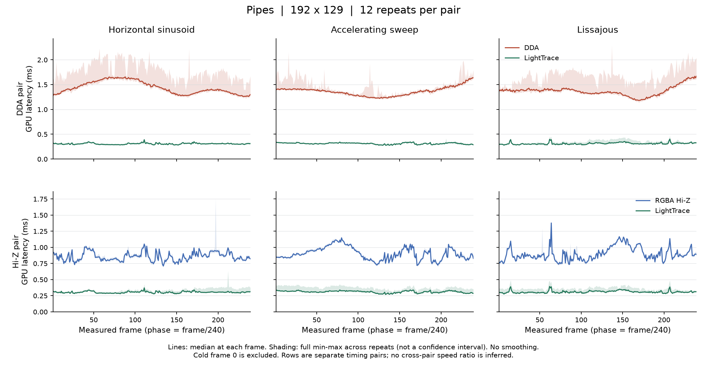

**Run 2**

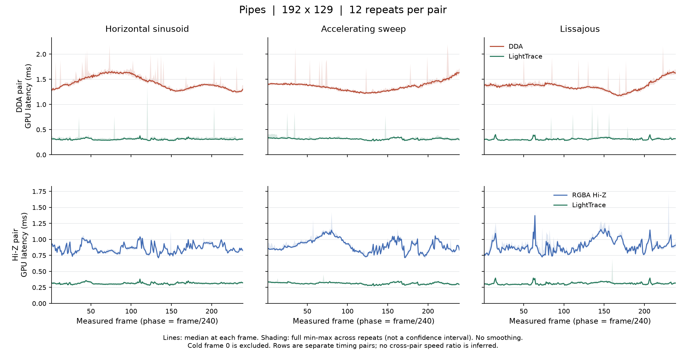

Playtable — both runs

**Run 1**

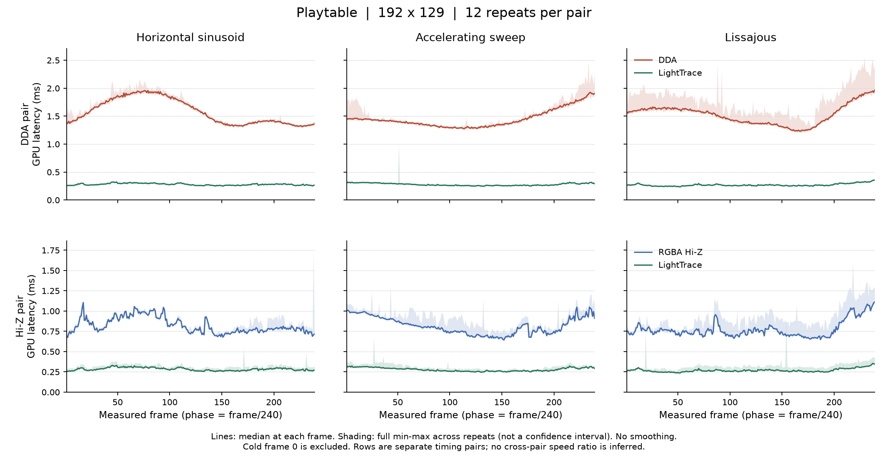

**Run 2**

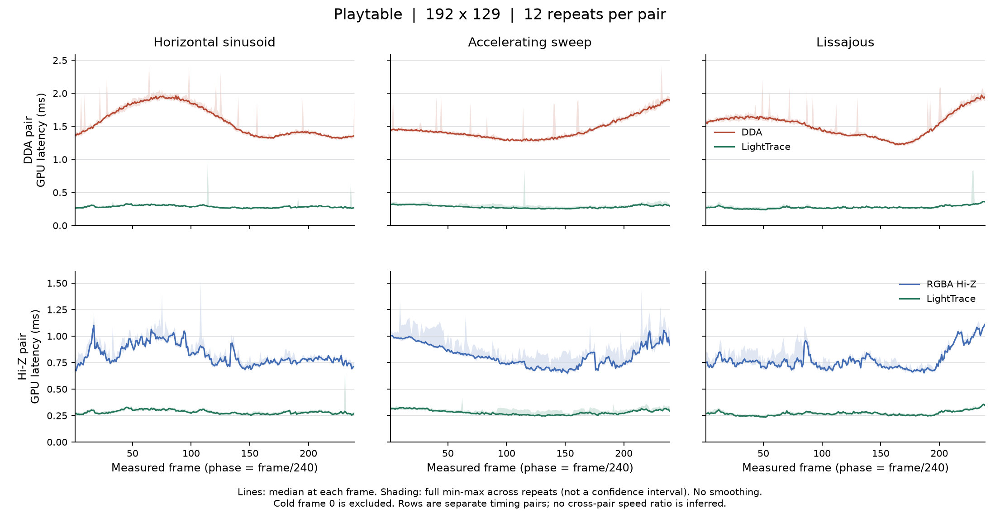

Motorcycle — both runs

**Run 1**

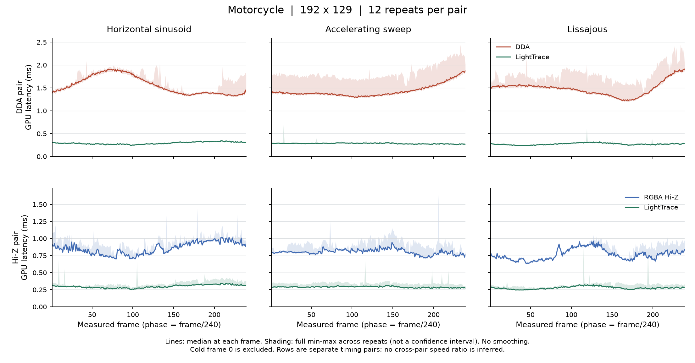

**Run 2**

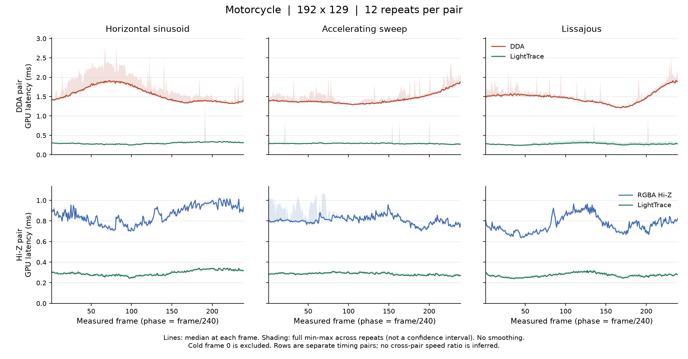

Sticks — both runs

**Run 1**

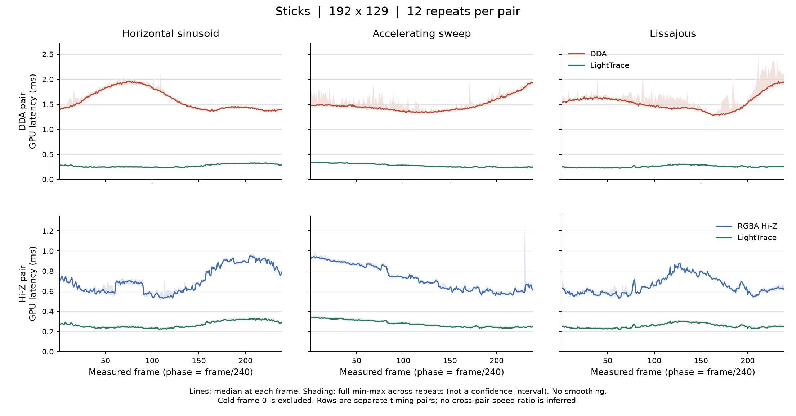

**Run 2**

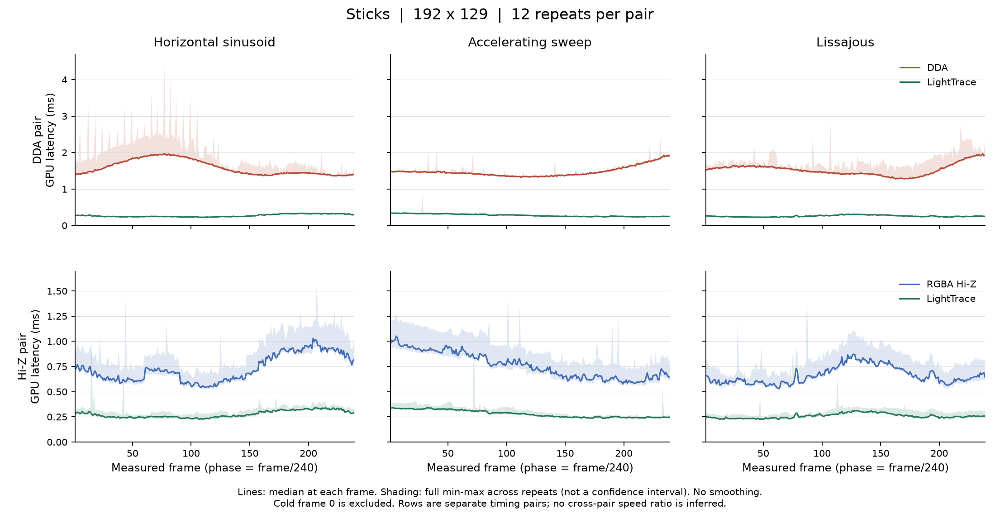

Shelves — both runs

**Run 1**

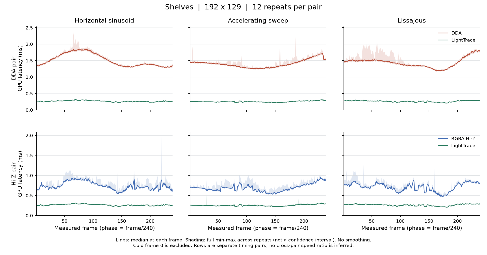

**Run 2**

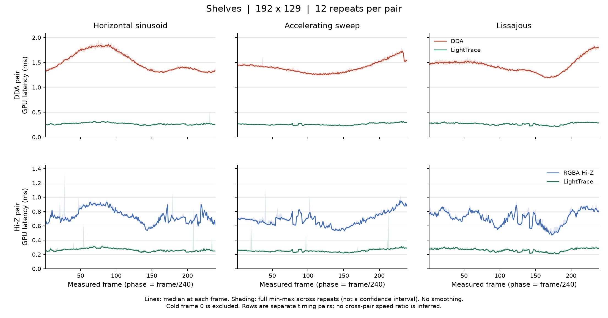

Adirondack — both runs

**Run 1**

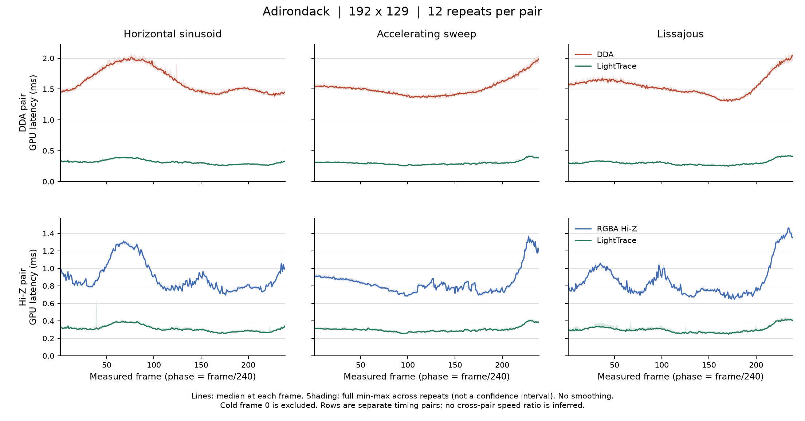

**Run 2**

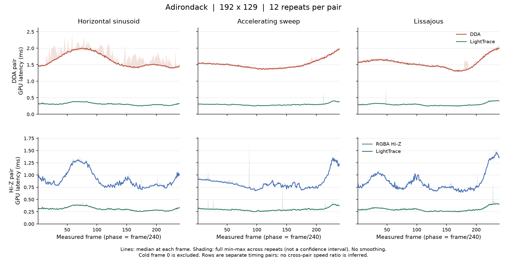

ARKitScenes 41069021 — both runs

**Run 1**

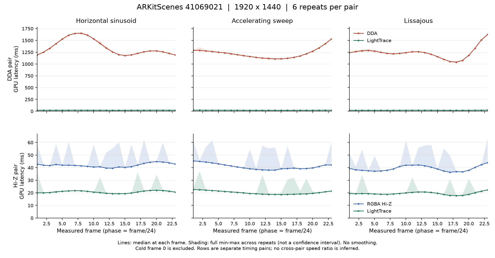

**Run 2**

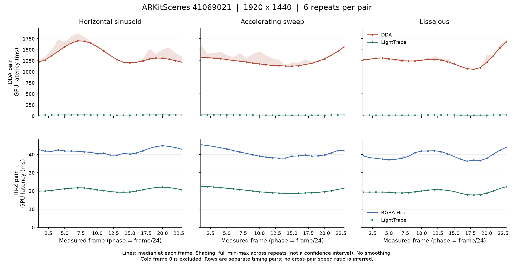

ARKitScenes 41069042 — both runs

**Run 1**

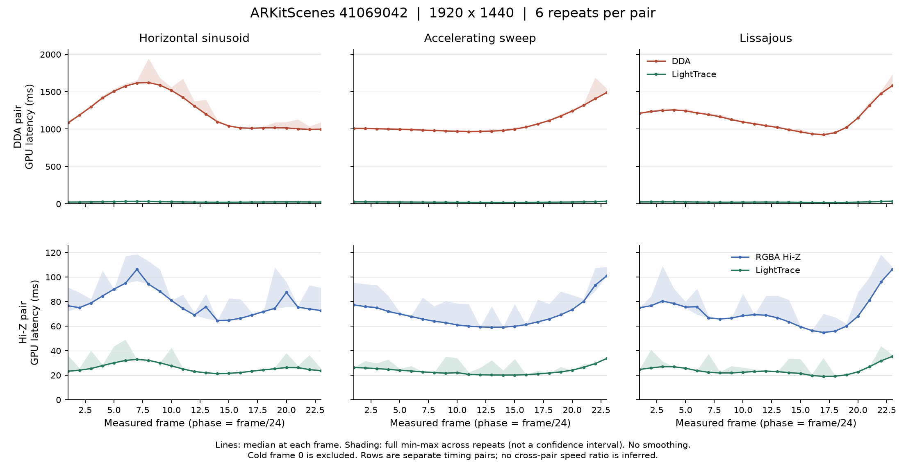

**Run 2**

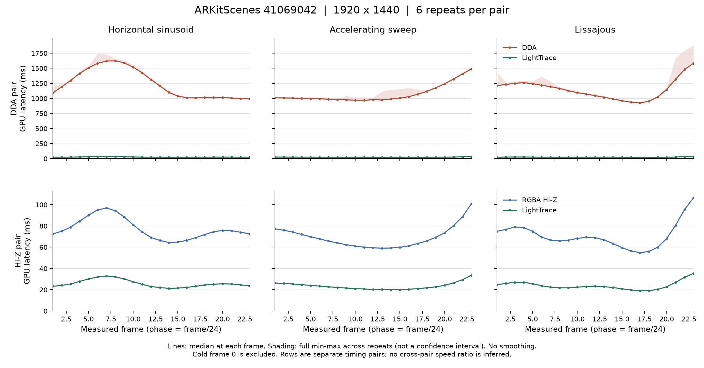

## Evidence files

All linked files are local to this repository. Run 1 is the original eight-input experiment; run 2 is the unchanged replication. Source paths inside provenance records identify the original experiment files, rather than implying that the full solver checkout or source datasets are included here.

| Evidence | Files |
|---|---|
| Exact two-run results, counts, confidence intervals, ablation, and initialization | [Combined JSON](data/results.json) |
| Individual run summaries | [Run 1](data/run-1/summary.json) · [Run 2](data/run-2/summary.json) |
| Cross-run deterministic validation | [73-check comparison](data/replication-checks.json) |
| Input selection, preprocessing, and source/array hashes | [Run 1](data/run-1/inputs.json) · [Run 2](data/run-2/inputs.json) |
| All raw timing CSVs, including frame 0 and the ablation | [Run 1 ZIP](data/run-1/raw-timings.zip) · [Run 2 ZIP](data/run-2/raw-timings.zip) |
| Per-frame summaries used to draw the curves | [Run 1 CSV](data/run-1/latency-curves.csv) · [Run 2 CSV](data/run-2/latency-curves.csv) |
| Plot settings and source hashes | [Run 1](data/run-1/latency-curves-manifest.json) · [Run 2](data/run-2/latency-curves-manifest.json) |
| Independent synthetic checks | [Run 1](data/run-1/validation-stress.json) · [Run 2](data/run-2/validation-stress.json) |
| Independent dataset checks | [Run 1](data/run-1/validation-dataset.json) · [Run 2](data/run-2/validation-dataset.json) |
| Independent ablation-build checks | [Run 1](data/run-1/validation-ablation.json) · [Run 2](data/run-2/validation-ablation.json) |
| Method/application figure provenance | [Figure records](data/figure-provenance.json) |
| File integrity and original/exported hashes | [Package manifest](data/package-manifest.json) |

Raw timing rows retain the input, repeat, method order, trajectory, frame index, warm/cold phase, and latency in milliseconds. The records use `dda` for DDA, `hiz_minmax` for RGBA Hi-Z, and `hiz_min_stackless` for LightTrace; ablation methods are `r32_coarsest_restart` and `r32_local_ascent`. Public JSON copies normalize local machine paths while preserving numerical results. Original-file and exported-file hashes are recorded separately.
